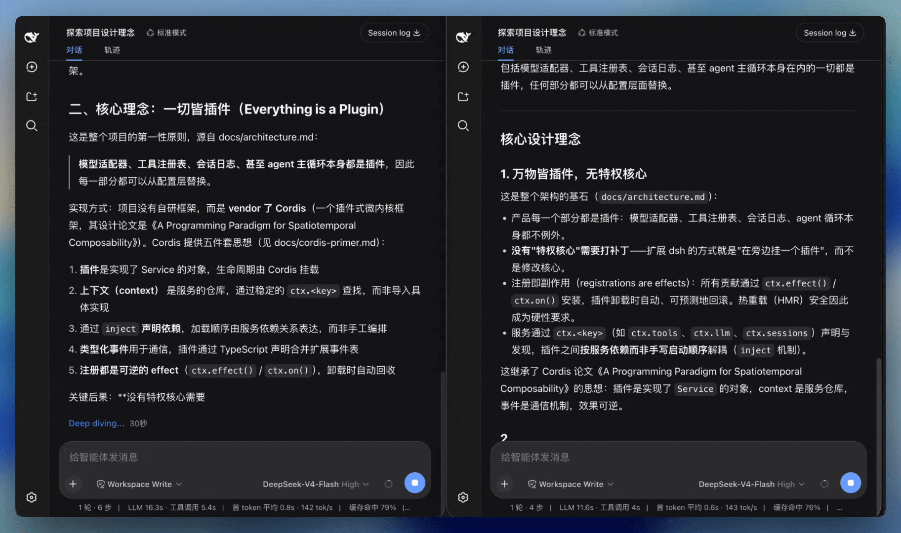

# dsh-smooth-stream

English | [中文](README.md)

[](https://whyihaveyou.github.io/dsh-suite/)

**dsh-smooth-stream** is a [DeepSeek Harness](https://github.com/deepseek-ai/deepseek-harness) (`dsh`) community plugin for **silky streaming** in the Web UI: arrival-tracking typewriter reveal, glide-in wraps, no flicker. It is not part of the official DeepSeek distribution.

Project homepage: <https://laplace-bit.github.io/dsh-smooth-stream/>

## Preview

Left: default Web UI. Right: dsh-smooth-stream.



## What it does

- **Reveal tracks the model.** Assistant text appears at a cadence that follows the arrival rate. Fast bursts do not dump a whole paragraph; a slow stream does not sit still and then jump.
- **Markdown stays markdown.** Code, emphasis, and the rest render while the reply is still coming. There is no plain-text tail that later swaps into formatted markdown.
- **Wraps glide in.** A new line or a growing tool card eases into view instead of snapping the transcript up by a line.
- **You keep the scroll.** Scroll up to read earlier text and the overlay lets go. Follow resumes only when you return to the bottom — the to-bottom button counts.
- **Think stays the built-in row.** Reasoning uses the usual disclosure. It opens while thinking is the live tail and closes when thinking ends; the chevron still toggles by hand.
- **The rest of the turn moves with it.** Running tool cards, model retries, and workflow runs share the same follow, so the whole turn slides instead of only the assistant text.
- **It backs off when it should.** `prefers-reduced-motion` shows the finished text at once and does not take follow. If the frame rate drops below 30 fps and the reply is off-screen, reveal pauses and catches up when the view is healthy again.

## Install

From a DeepSeek Harness source checkout:

```sh
pnpm dsh plugin --profile web add dsh-smooth-stream
```

If `dsh` is already on your `PATH`:

```sh
dsh plugin --profile web add dsh-smooth-stream
```

The npm package ships prebuilt `lib/`, so no pnpm ≥10 build-script allowance is needed.

Start the UI:

```sh
pnpm dsh web
```

The Host log should include `[dsh-smooth-stream] plugin loaded!`.

Remove it with `pnpm dsh plugin --profile web remove dsh-smooth-stream` (or `dsh plugin --profile web remove dsh-smooth-stream`).

## Configuration

The bundle installs with `preset: balanced`. Change it in the profile `cordis.patch.yml` if you want a different cadence:

| `preset` | Feel |
| --- | --- |
| `realtime` | Keeps closer to the model |
| `balanced` | Default |
| `silky` | More buffer, slower catch-up |

`maxScrollSpeedPxPerSec` (default `1000`) is a ceiling so the first large lag does not teleport.

## User settings

In the Web UI, open **Settings → Plugins → Plugin configuration** to find a **Smooth stream** card with an **"Auto-expand thinking"** toggle:

- **On** (default): reasoning blocks auto-expand while streaming and collapse when thinking ends — the plugin's default behavior.
- **Off**: reasoning blocks stay collapsed; you can still open one by hand, and the stream state will not wrestle it back.

This is a durable, user-level preference that applies live without a restart, and is written to the DeepSeek Harness user-settings document rather than the plugin's composed configuration.

## About & updates

- **Version / homepage / license**: see the top of this page and the `version`, `homepage`, `repository`, and `license` fields in [package.json](package.json). Installed plugins are listed under **Settings → Plugins → All**.
- **Updates**: the card shows the version loaded by the Host. When the active profile declares `dsh-smooth-stream` as an npm dependency, its **Update** button runs the same fixed package update for that profile and then asks you to restart Harness. A `link:` or `file:` development install is shown as a development version and deliberately leaves the button disabled, so it cannot replace your checkout.

You can also update an npm-installed profile from the command line:

```sh
dsh plugin --profile web update dsh-smooth-stream
```

(`dsh plugin --profile web outdated` shows whether a newer version exists.)

## FAQ

**Is this an official DeepSeek plugin?**
No. It is a community plugin for the DeepSeek Harness (`dsh`) Web UI, MIT-licensed, and not part of the official DeepSeek distribution.

**How do I install a DeepSeek Harness plugin?**
Use the built-in plugin command: `dsh plugin --profile web add dsh-smooth-stream` from a dsh source checkout (see [Install](#install)).

**Can I install it from npm?**
Yes — `dsh-smooth-stream` is published to [npm](https://www.npmjs.com/package/dsh-smooth-stream). `dsh plugin --profile web add dsh-smooth-stream` installs the prebuilt package.

**Does it respect `prefers-reduced-motion`?**
Yes. With reduced motion enabled the finished text is shown at once and the plugin does not take over follow. If the frame rate drops below 30 fps while the reply is off-screen, reveal pauses and catches up later.

## License

[MIT](LICENSE)
